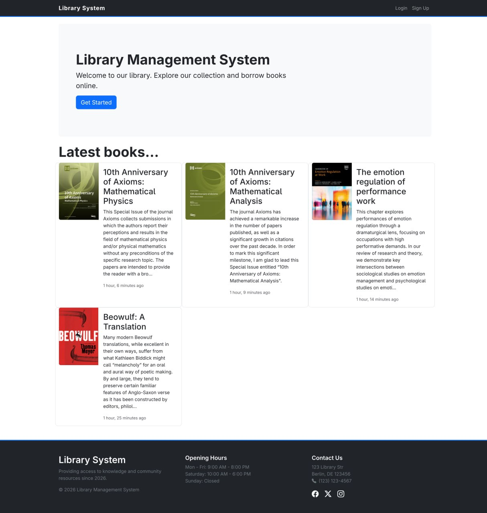
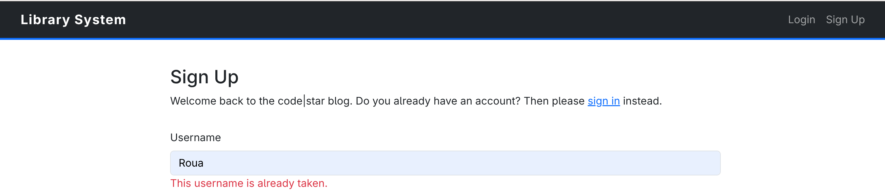
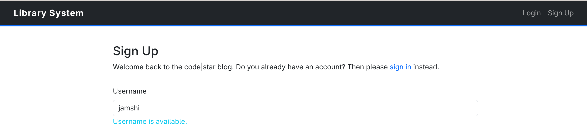
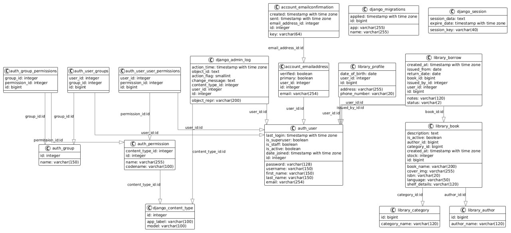
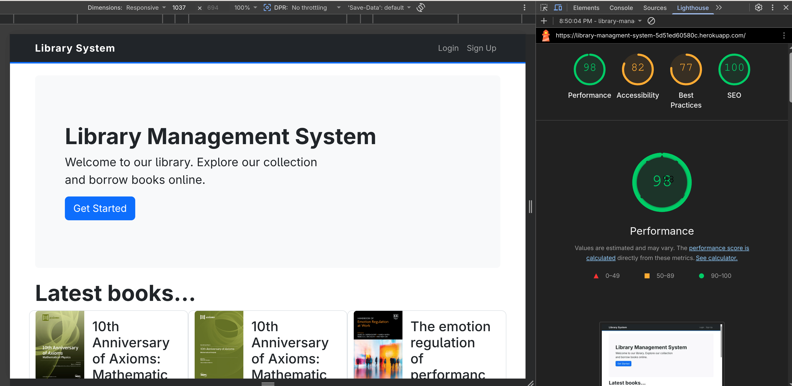

# Library Management System

A web-based Library Management System built with Django designed to streamline
and automate the core operations of a library. The system provides an efficient
way to manage books, authors, categories, and users, while handling key
circulation processes such as issuing, returning, and renewing books.
It supports both admin/staff users and regular users, each with clearly defined
roles and responsibilities. Admins and staff have full control over the system,
including managing the book catalog, organizing authors and categories,
handling user accounts, and processing book transactions. Regular users can
browse the catalog, view detailed book information, borrow available books,
request renewals, and track their borrowing history.

The application implements role-based access control, ensuring that only
authorized staff members can perform specific operations like issuing or
returning books. This enhances both security and operational reliability.
Additionally, the system features a responsive user interface built with
Bootstrap, providing a clean and user-friendly experience across different
devices. With support for pagination, search, and filtering (by ISBN, title,
and author), the platform is designed to handle larger datasets efficiently and
improve usability.

The system also integrates Cloudinary for efficient cloud-based media storage
and delivery.
Overall, the system aims to reduce manual workload, improve record accuracy,
and provide a structured, scalable solution for modern library management.



## Features

### Admin and Staff Features

### Add, Update, and Delete Books

Admins or staff can manage the library catalog by adding new books, editing
existing book details (such as title, author, ISBN, and available copies), and
removing books that are no longer in circulation. This ensures the catalog
remains accurate and up to date.

While adding a **Book**, users can select existing **Authors** and **Categories
**, or optionally create new ones at the same time.

- Similarly, when adding an **Author** or **Category**, they can optionally
  link or create related **Books**.

- This flexible workflow allows users to either reuse existing data or create
  and associate new records as needed.


### Filter and Search Books

Admins can quickly locate books using filtering and search functionality based
on ISBN, title (name), or author. This makes it efficient to manage large
collections and perform updates without manually browsing through all records.


### Manage Book Authors

Staff can create, update, and delete author records. This ensures proper
organization of books and prevents duplication of author information.


### Manage Book Categories

Admins can define and manage book categories (e.g., Fiction, Science,
Technology), improving organization and making it easier for users to browse
books.


### Manage Staff

Admin can view and manage staff accounts, including creating new staff members,
updating their information, and controlling their access permissions. Staff
members are responsible for managing books, authors, and categories, as well as
handling book issuance, renewal, and returns.


### Issue Books to Users

Staff are responsible for issuing books to users. When a book is issued, the
system records the issue date and calculates a due date, while also updating
the number of available copies.


### Approve and Handle Returns & Renewals

Staff oversee the return and renewal process. They can confirm when a book is
returned (updating availability) and approve renewal requests, extending the
borrowing period when applicable.


## User Features

Users can **sign up** and **log in** to access the system.


### Async Username Validation on Signup

During the signup process, the system performs real-time async validation of
the username field. As users enter a username, the system automatically checks
if it's available in the database without requiring a page refresh or form
submission. This validation:
- Checks for username availability in real-time
- Provides instant feedback if the username is already taken
- Prevents duplicate username registration errors
- Improves user experience by catching conflicts early
- Uses AJAX to communicate with the backend without page reload





### Browse Available Books

Users can explore the library catalog with a paginated listing of books, making
it easy to navigate through large collections efficiently.


### View Book Details

Each book has a detailed view displaying key information such as title, author,
ISBN, availability status, and cover image, helping users make informed
borrowing decisions.


### borrow books

users can request to borrow available books. once approved or processed by
staff, the book is issued and linked to the user’s account with a defined due
date.


### Cancel the borrow request

Before the staff issues the book, the user can cancel the request. Using the
"my borrows" page.


### Renew Borrowed Books

Users can renew the borrowed books before the due date once without staff,
Using the "my borrows" page.


### Track Borrowing History

Users can view their borrowing history, including issued books, due dates,
returned items, and current borrowing status. This provides transparency and
helps users manage deadlines effectively.


## Tech Stack

    • Backend: Django (Python),Pycharm
    • Frontend: HTML, CSS, Bootstrap
    • Database: PostgreSQL(dbeaver)
    • Authentication: Django’s built-in authentication system

### Architecture (Django MVT Pattern)

The application is built using Django’s MVT (Model–View–Template) architectural
pattern, which is conceptually similar to the traditional MVC pattern.

### MVC vs Django (MVT Mapping)

MVC Component Django Equivalent Description
Model Model Handles database structure and data logic
View Template Responsible for UI and presentation layer
Controller View Contains business logic and request handling

## Components Overview

### Model (Data Layer)

Defines the structure of the database using Django ORM.
Examples in this project:
• Book
• Author
• Category
• BorrowRecord
The model handles:
• Data validation
• Relationships (e.g., book–author, book–category)
• Database queries

### View (Business Logic Layer)

Django views act like controllers in MVC. They:
• Process incoming HTTP requests
• Interact with models
• Apply business logic (issue, return, renew books)
• Return responses (HTML pages or redirects)

### Template (Presentation Layer)

Templates define how data is displayed to users using HTML and Django Template
Language (DTL).
They:
• Render dynamic content
• Display book listings, forms, and user data
• Use Bootstrap for responsive UI

### Request Flow

    1. User sends a request (e.g., view books)
    2. URL routes the request to a Django view
    3. View processes logic and interacts with models
    4. Data is passed to a template
    5. Template renders the final HTML response

## Database

The application uses PostgreSQL as the primary database in production,
providing better performance, scalability, and reliability compared to SQLite.

### Development vs Production

    • Development: SQLite (default Django database for simplicity)
    • Production: PostgreSQL (via Heroku Postgres)

### Configuration

Database settings are defined in `config/settings.py` and are read from
environment variables. This lets you keep sensitive credentials out of the
repository and makes it easy to configure the application on hosting platforms
like Heroku via config vars. Example database configuration from
`settings.py`:

```python
import os
DATABASES = {
  'default': {
    "ENGINE": "django.db.backends.postgresql",
    "NAME": os.environ.get("POSTGRES_DB_NAME"),
    "USER": os.environ.get("POSTGRES_DB_USERNAME"),
    "PASSWORD": os.environ.get("POSTGRES_DB_PASSWORD"),
    "HOST": os.environ.get("POSTGRES_DB_HOST"),
    "PORT": "5432",
    'OPTIONS': {'sslmode': 'require'},
  }
}
```

### Entity Relationship Diagram (ERD)



## Authentication

The application uses Django’s built-in authentication system to handle user
registration, login, and access control.
It provides:

    • User Registration & Login: Secure authentication for users and staff
    • Password Management: Password hashing and validation handled by Django
    • Session Management: Maintains user sessions after login
    • Role-Based Access: Differentiates between admin/staff and regular users
    • Permission System: Restricts actions such as issuing, returning, and renewing books to authorized staff only

## Media File Handling (Cloudinary)

The application uses Cloudinary for managing and serving uploaded media files
such as book cover images.

**Configuration**

Cloudinary is integrated into the Django project using environment variables
for secure configuration:

    • CLOUDINARY_CLOUD_NAME
    • CLOUDINARY_API_KEY
    • CLOUDINARY_API_SECRET

These credentials are stored in Heroku Config Vars and not exposed in the
codebase.

## Future Improvements

    • Email notifications for due dates
    • Fine calculation for late returns
    • REST API (Django REST Framework)
    • Advanced search and filtering
    • Docker deployment

## Development Methodology (Agile)

This project was developed using an Agile methodology, focusing on iterative
development, continuous improvement, and incremental feature delivery.

### Iterative Development

The system was built in multiple small iterations, where each phase introduced
a specific set of features. This allowed continuous testing and refinement
throughout development.

### User Stories

Features were planned and implemented using user stories to define requirements
clearly. Examples:

    • As a user, I can browse available books so that I can choose what to borrow
    • As an admin, I can manage books so that the catalog stays updated
    • As staff, I can issue and return books so that circulation is properly tracked

## Installation

### 1. Clone the Repository:-

    git clone https://github.com/your-username/library-management.git
    cd library-management

### 2. Create Virtual Environment

    python -m venv venv
    source venv/bin/activate
    # On Windows: venv\Scripts\activate

### 3. Install Dependencies

    pip install -r requirements.txt

### 4. Apply Migrations

    python manage.py migrate

### 5. Create Superuser

    python manage.py createsuperuser

### 6. Run the Server

    python manage.py runserver
    Visit: http://127.0.0.1:8000/

## Automated Testing (tests.py)

    Unit tests and basic integration tests have been written to validate core functionalities, including:
    • Book creation, update, and deletion
    • Author and category management
    • User-related operations
    • Book issue, return, and renewal workflows
    • Validation of business rules (e.g., book availability)

### Permission Testing

    Tests verify that role-based permissions are enforced correctly:
    • Only staff users can issue, return, or renew books
    • Regular users are restricted from admin-level actions

### Workflow Testing

    Key system workflows are tested to ensure proper behavior:
    • Issuing a book updates availability and creates a record
    • Returning a book updates status and restores availability
    • Renewing a book correctly extends the due date

### Running Tests

    To execute the test suite, run:
     python manage.py test
    This will automatically discover and run all test cases defined in tests.py.

### Manual Testing of User Interface (UI)

This section describes a manual test plan for the frontend (UI) of the
application. Use these steps to quickly verify visual correctness, form
validation, navigation, responsiveness, and basic accessibility before
running automated tests or user acceptance testing.

Manual testing checklist

- Environments & tools
  - Test in latest stable Chrome, Firefox, and an up-to-date mobile browser
    (Safari or Chrome on Android). Use browser devtools to simulate mobile
    devices and different network conditions.
  - Verify static assets (CSS/JS) load correctly and image uploads are
    served via Cloudinary in production-like environments.

- Pages & navigation
  - Confirm header, footer, and primary navigation display and behave
    consistently across pages (home, book list, book detail, staff views,
    user account pages).
  - Validate links and buttons navigate to the correct routes and that
    back/forward browser navigation behaves as expected.

- Forms & validation
  - Test sign up, login, add/edit book, add/edit author/category, and borrow
    request forms with valid and invalid inputs. Ensure client- and
    server-side validation messages are clear and focus is returned to the
    first invalid field.
  - Verify file upload fields (cover images) accept expected file types and
    show previews or success messages when appropriate.
  - **Async Username Validation on Signup**: During the signup process, username
    validation is performed asynchronously in real-time as the user types.
    The system checks if the username is already taken without requiring a full
    form submission. If the username is unavailable, an error message is
    displayed immediately, allowing users to choose an alternative username
    before completing registration. This provides instant feedback and improves
    the user experience by preventing form submission errors related to
    duplicate usernames.

- Borrow/Issue/Return flows
  - Walk through user borrow request and staff issue/approve/return/renew
    flows. Check that availability counters update and UI states (pending,
    issued, returned, renewed) are rendered correctly in lists and detail
    pages.

- Responsiveness & layout
  - Resize the viewport and test common breakpoints (mobile, tablet,
    desktop). Verify grid/list views, forms and modals adapt without
    overlap or overflow.

- Accessibility & usability
  - Verify keyboard navigation works for forms and interactive elements.
  - Check color contrast for primary UI elements and ensure images have
    meaningful alt text where applicable.

- Visual QA
  - Confirm wireframe design is matching the rendered
    UI where relevant. Look for spacing, layout and alignment regressions.

Record results, steps to reproduce any issues, and include screenshots or
browser console logs when reporting bugs. This checklist is intended for
quick manual verification of frontend changes before releasing.

## Validators testing(to-do)

**w3c

css

python

docstring

light house report**

### light house report**


## References

- [Django Official Website](https://www.djangoproject.com)
  Core framework documentation and resources.

- [Customize Django Admin](https://testdriven.io/blog/customize-django-admin/#custom-admin-actions)
  How to extend and customize admin functionality.

- [django-widget-tweaks](https://github.com/jazzband/django-widget-tweaks)
  Template-level form customization library.

- [Reusable Form Templates](https://docs.djangoproject.com/en/5.2/topics/forms/#reusable-form-templates)
  Best practices for reusable Django forms.

- [Custom Authentication](https://docs.djangoproject.com/en/6.0/topics/auth/customizing)
  Customizing Django authentication system.

- [DOAB Books Directory](https://directory.doabooks.org)
  Open-access book dataset used in this project.

- [Django Blog Source Code](https://github.com/Code-Institute-Solutions/django-blog-sourcecode/tree/main)
  Used as a reference for Django development patterns and implementation.
